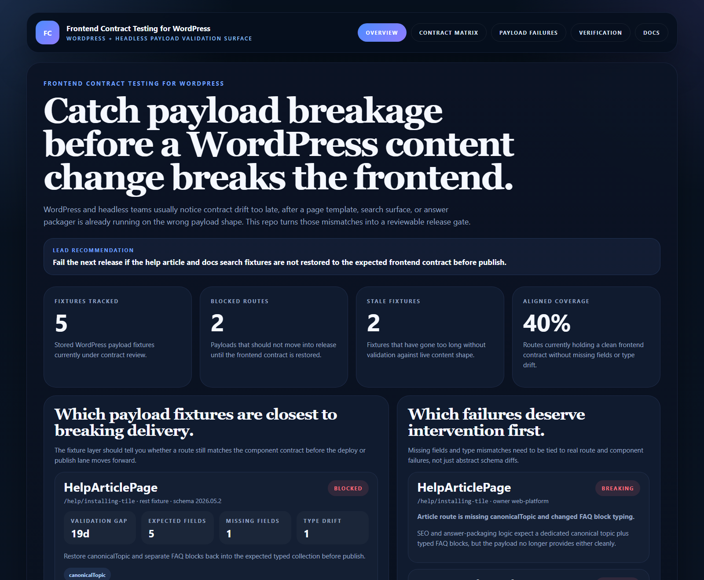
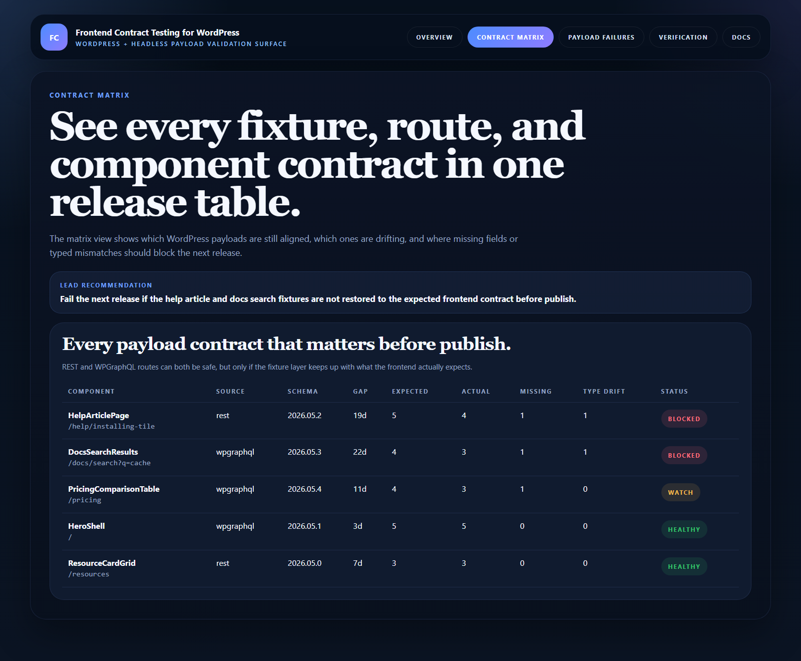
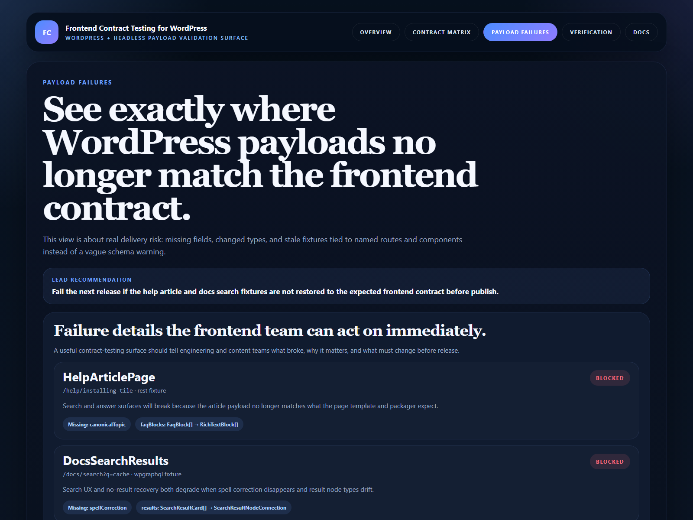
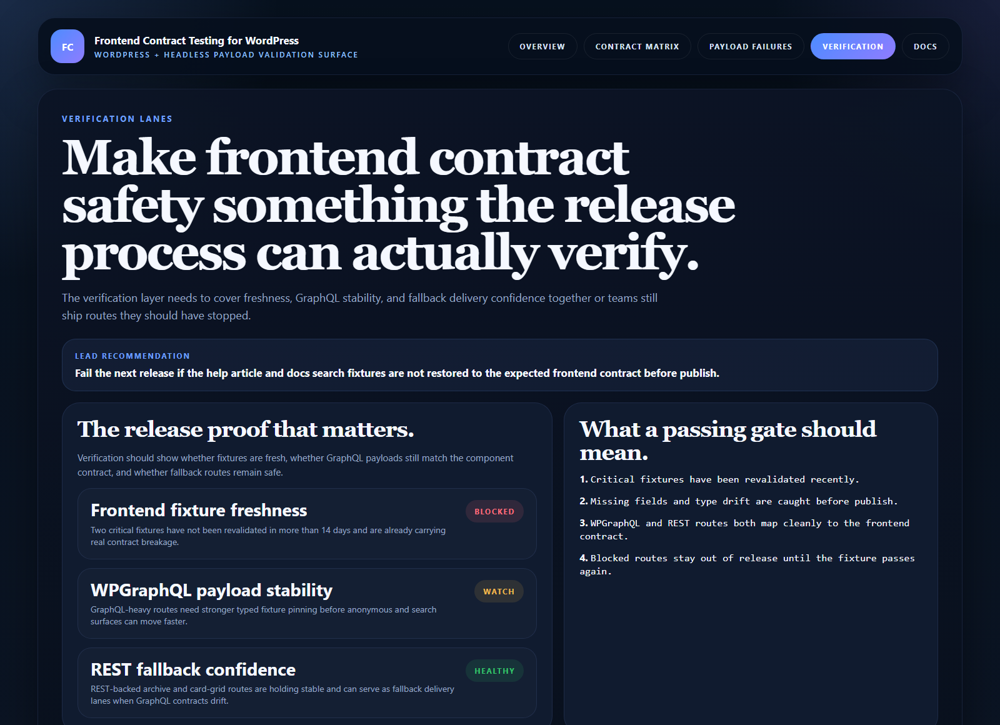

# Frontend Contract Testing for WordPress

TypeScript control surface for **testing WordPress REST and WPGraphQL payloads against real frontend component expectations before publish or deploy breaks delivery**.

> **What this repo proves**
>
> Content model drift is only half the problem. The other half is whether the payload still matches what the frontend actually expects route by route.

## Why this repo exists

Headless WordPress stacks break in production when content payloads evolve faster than the frontend fixtures, search templates, and answer surfaces built on top of them. A field disappears, a nested collection changes type, or a GraphQL result node stops matching the card or page shell that consumes it.

`frontend-contract-testing-for-wordpress` models that delivery risk directly. It treats payload fixtures as a release gate, scores freshness and drift, and exposes which routes should be blocked before they reach users.

## Screenshots






## What it includes

- Express app with HTML proof surfaces and JSON APIs
- sample WordPress REST and WPGraphQL payload fixtures
- route-to-component contract matrix
- missing-field and type-mismatch failure views
- fixture freshness and release verification lanes
- real browser-rendered README proof assets

## Local run

```powershell
cd frontend-contract-testing-for-wordpress
npm install
npm run dev
```

Open:

- [http://127.0.0.1:5228/](http://127.0.0.1:5228/)
- [http://127.0.0.1:5228/contract-matrix](http://127.0.0.1:5228/contract-matrix)
- [http://127.0.0.1:5228/payload-failures](http://127.0.0.1:5228/payload-failures)
- [http://127.0.0.1:5228/verification](http://127.0.0.1:5228/verification)
- [http://127.0.0.1:5228/docs](http://127.0.0.1:5228/docs)

## Validation

```powershell
npm run verify
npm run render:assets
```

## API routes

- `GET /api/dashboard/summary`
- `GET /api/fixtures`
- `GET /api/failures`
- `GET /api/contract-matrix`
- `GET /api/verification`
- `GET /api/sample`

## Docs

- [Architecture notes](./docs/architecture.md)
- [Why we built this](./docs/ORIGIN.md)
